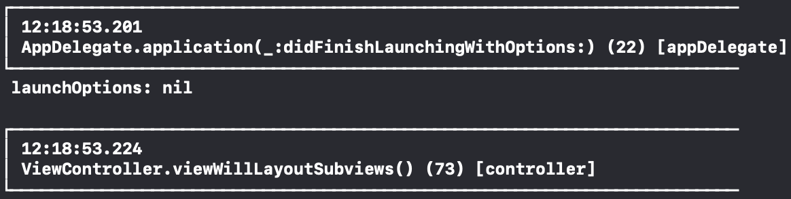
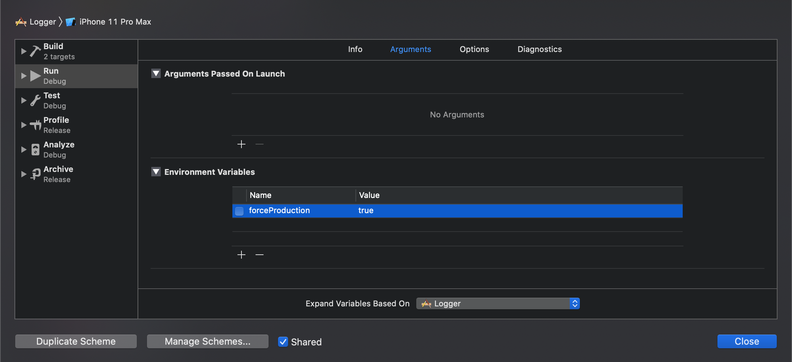

# LoggerExample



iOS Logger project example   
Inspied by [this post](https://medium.com/the-aesthetic-programmer/swift-console-logger-e25ded4d1748)

### Disclamer
This is not a framework. The idea is for it to be used inside your own project, by simply copying the `Debug` folder, as to have no external dependencies.

## Getting started

`Logger` class is a singleton that must be initialized using `setup()`:

```
Logger.setup()
```

`setup` has three parameters:

* `queue`: The `DispatchQueue` the logger will use, so it doesn't interfere with the Main queue. The default value of this property is `DispatchQueue(label: "Logger")`

* `modules`: Array of `[WriterProtocol]` the logger will call the `write` method. The default value of this property is `[ConsoleWriter()]`

* `logLevel`: `LogLevel`. Can be `verbose` or `filtered`. The default value of this property is `.verbose`.

## Usage

To log something, simply call the log method `log(_:)`:

```
Logger.shared.log(.appDelegate)
```

`log(_:)` has five parameters:

* logType: the `LogType` classification of the log message.

* logMessage: optional `String?`log message. The default value of this property is `nil`.

* file: Name of the file `log` was called. The default value of this property is `#file`.

* functionName: Name of the function `log` was called. The default value of this property is `#function`.

* lineNumber: Number of the line `log` was called. The default value of this property is `#line`.

## LogLevel

When setting the `LogLevel` in the `setup` there are currently two choices: `verbose` or `filtered`.

### Verbose

Verbose level will log all messages.

### Filtered

Filtered level must be accompanied with a `LogType`. For instance:

```
Logger.setup(logLevel: .filtered(.appDelegate))
```

The Logger will only write logs of the chosen type.

It is possible to add new types, by simply adding cases to the `LogType` enum. For example adding a `network` type to log network calls:

```
enum LogType {
	case network
	...
}
```

Setup the logger to only write logs of the network type:

```
Logger.setup(logLevel: .filtered(.network))
```

And when calling the `log` method:

```
Logger.shared.log(.network, logMessage: response)
```

Now only logs with the `network` type will be written.

## Environment

The Logger is set to only write when the environment the app is running is `DEBUG`.

It is possible to simulate a production environment by toggling a environment variable in Product > Scheme > Edit Scheme... and selecting `forceProduction` in the Arguments section:



This will simulate the Production environment and no logs will be written.

## Modules

There are currently only one module for the project, the `ConsoleWriter`.

To add different modules, simply add more classes that conform to the protocol `WriterProtocol`.

For instance, you need to write your logs to a .txt file, you could add a file writer class that does the job:

```
final class FileWriter: WriterProtocol {

    func write(_ items: Any..., separator: String, terminator: String) {
        // implementation
    }
}
```

Then add a `FileWriter` instance to the `setup()` initialization:

```
static func setup(queue: DispatchQueue = DispatchQueue(label: "Logger"),
                  modules: [WriterProtocol] = [ConsoleWriter(), FileWriter()],
                  logLevel: LogLevel = .verbose) {
    if sharedInstance == nil {
        sharedInstance = Logger(queue: queue, modules: modules, logLevel: logLevel)
    }
}
```

Now logs will both be printed in Xcode console and written on a file.

## License

This project is licensed under the MIT License - see the [LICENSE](LICENSE) file for details